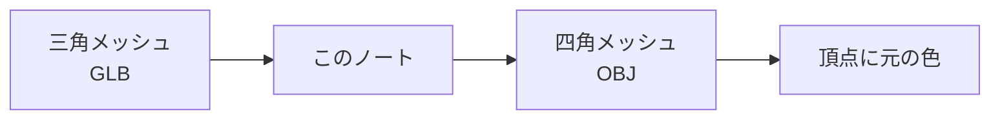
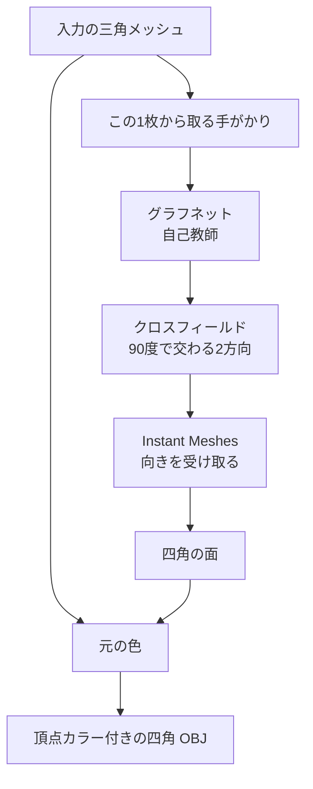
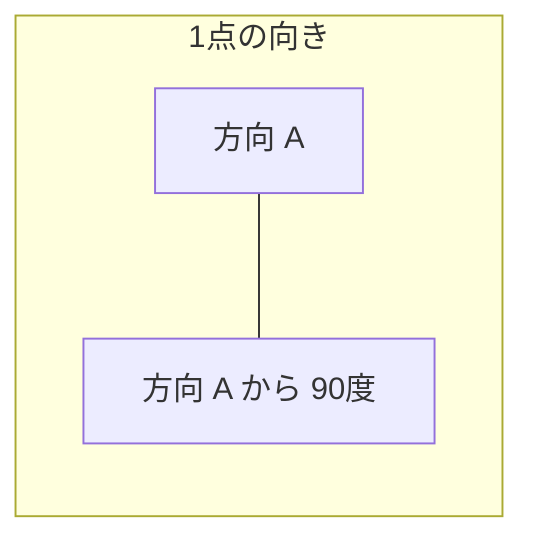
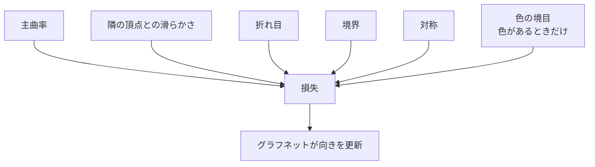

# 自己教師クロスフィールドで四角メッシュを張る

**小林洋介（Yosuke Kobayashi）**  
https://yosuke4061.com/

一つの三角メッシュ（GLB）を、四角メッシュ（OBJ）に作り直します。辺の向きは、そのメッシュ自身から学習したクロスフィールドに従います。色は新しく塗りません。元のメッシュの色を、四角の頂点へ写します。

ノートは英語です。Colab で上から順に実行します。GPU ランタイム、Python 3.13。実行の途中でランタイムを変えないでください。ComfyUI は使いません。

[Open in Colab](https://colab.research.google.com/github/koba4061/triangle-to-quad-remeshing-/blob/main/learned_cross_field_quad_remeshing.ipynb)

## 使う人から見た流れ

一覧からサンプルを選ぶか、自分の GLB を `upload` で送ります。サンプルとプログラムは、このリポジトリの `inputs/` と `brief153_colab.zip` から取ります。

出来たファイルは二つです。

| ファイル | 中身 |
| --- | --- |
| `quad.obj` | 四角の面。頂点、法線、頂点カラー |
| `color.obj` | 同じ四角。頂点カラーだけ。見るならこちら |

各頂点は `v x y z r g b` です。RGB は 0 から 1。マテリアルとテクスチャは作りません。金属感や粗さ、法線マップが要るときは、元の GLB を源、この四角 OBJ を先にして、Blender で自分で焼きます。

## 何をしているか

面を張るのはグラフネットではありません。グラフネットが決めるのは、表面の各点における向きです。その向きを Instant Meshes が受け取り、四角の面を張ります。

クロスフィールドは 4-RoSy です。十字を 90 度回しても、同じ向きの組とみなします。辺は、その十字に沿って通ります。

## 学習は、答えの十字を与えない

学習データに「正しいクロスフィールド」はありません。損失は、そのメッシュから計算します。200 エポックより前に、損失が改善しなくなったら止まります。

色は方向そのものではありません。色の境目があるとき、そこも向きを決める手がかりの一つです。色が無いメッシュでも、四角は作れます。その場合、頂点カラーの書き出しは飛ばします。

グラフネットは GraphSAGE 型です。ネットワークはこのメッシュのグラフの上に乗ります。曲率は、近傍の表面を当てはめて推定します。

面が 79 万を超える入力は、向きの学習と Instant Meshes には 79 万面まで減らして渡します。四角の枚数は、その減らした面数から決めます。張った頂点は、その後で元の表面へ戻します。

細長い三角が多い入力は、学習の前に止まります。高さがいちばん長い辺の 2% 未満の面が、全体の 0.15% を超える場合です。Instant Meshes が面を 1 枚も返さない場合も、そこで止まります。

## 参考文献

1. Dong ほか. NeurCross: A neural approach to computing cross fields for quad mesh generation. *ACM Transactions on Graphics* (SIGGRAPH), 2025. https://arxiv.org/abs/2405.13745
2. Jakob, Tarini, Panozzo, Sorkine-Hornung. Instant field-aligned meshes. *ACM Transactions on Graphics*, 34(6), 2015. https://igl.ethz.ch/projects/instant-meshes/
3. Ray, Vallet, Li, Lévy. N-symmetry direction field design. *ACM Transactions on Graphics*, 27(2), 2008.
4. Hamilton, Ying, Leskovec. Inductive representation learning on large graphs. *NeurIPS*, 2017. https://arxiv.org/abs/1706.02216
