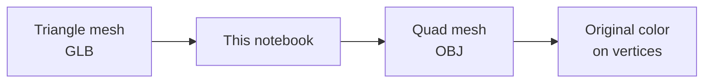
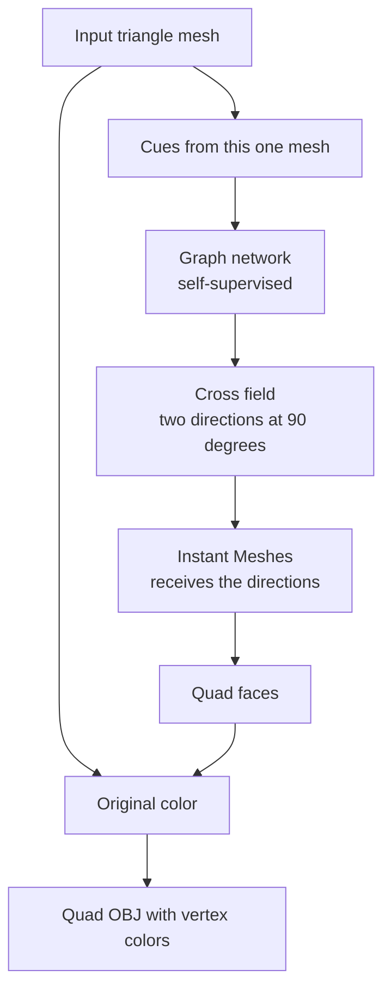
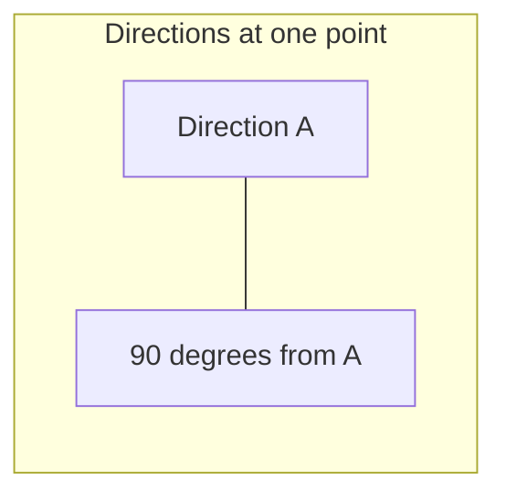
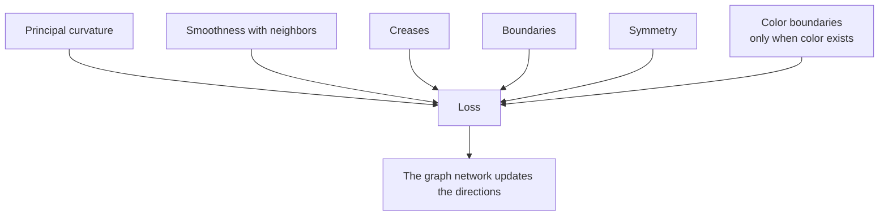

# Quad meshing from a self-supervised cross field

**Yosuke Kobayashi（小林洋介）**  
https://yosuke4061.com/

The core is two steps. A graph network builds a cross field on the triangle mesh: a direction at each point, learned from that mesh alone. Instant Meshes then lays the quad faces along that field.

The result is a quad mesh (OBJ). Colors are not painted anew. The original mesh colors are copied onto the quad vertices.

Run the notebook in Colab from top to bottom. Use a GPU runtime with Python 3.13. Do not change the runtime after you start. This notebook does not use ComfyUI.

[Open in Colab](https://colab.research.google.com/github/koba4061/triangle-to-quad-remeshing-/blob/main/learned_cross_field_quad_remeshing.ipynb)

## What you do

Pick a sample from the list, or choose `upload` and send your own GLB. Samples and the program come from `inputs/` and `brief153_colab.zip` in this repository.

You get two files.

| File | Contents |
| --- | --- |
| `quad.obj` | Quad faces, with vertices, normals, and vertex colors |
| `color.obj` | The same quads, with vertex colors only. Open this one |

Each vertex is `v x y z r g b`. RGB is from 0 to 1. No materials and no textures are written. For metalness, roughness, or a normal map, bake them yourself in Blender. Use the original GLB as the source and this quad OBJ as the target.

## What it does

The graph network writes the cross field. Instant Meshes reads that field and builds the quad faces.

The cross field is 4-RoSy. Turning the cross by 90 degrees leaves the same pair of directions. Edges run along that cross.

## Training has no labeled crosses

There is no training set of correct cross fields. The loss is computed from the mesh itself. Training stops before 200 epochs when the loss stops improving.

Color is not the direction. When the mesh has a color boundary, that boundary is one more cue for the direction. A mesh with no color still becomes quads. In that case, writing vertex colors is skipped.

The graph network is a GraphSAGE model. It sits on this mesh graph. Curvature comes from a local surface fit.

An input with more than 790,000 faces is reduced to 790,000 for the field and for Instant Meshes. The quad count is taken from that reduced face count. The new vertices are then moved back onto the original surface.

The run stops before training when too many triangles are skinny: height under 2% of the longest edge, on more than 0.15% of the faces. It also stops when Instant Meshes returns no faces.

## References

1. Dong et al. NeurCross: A neural approach to computing cross fields for quad mesh generation. *ACM Transactions on Graphics* (SIGGRAPH), 2025. https://arxiv.org/abs/2405.13745
2. Jakob, Tarini, Panozzo, Sorkine-Hornung. Instant field-aligned meshes. *ACM Transactions on Graphics*, 34(6), 2015. https://igl.ethz.ch/projects/instant-meshes/
3. Ray, Vallet, Li, Lévy. N-symmetry direction field design. *ACM Transactions on Graphics*, 27(2), 2008.
4. Hamilton, Ying, Leskovec. Inductive representation learning on large graphs. *NeurIPS*, 2017. https://arxiv.org/abs/1706.02216
